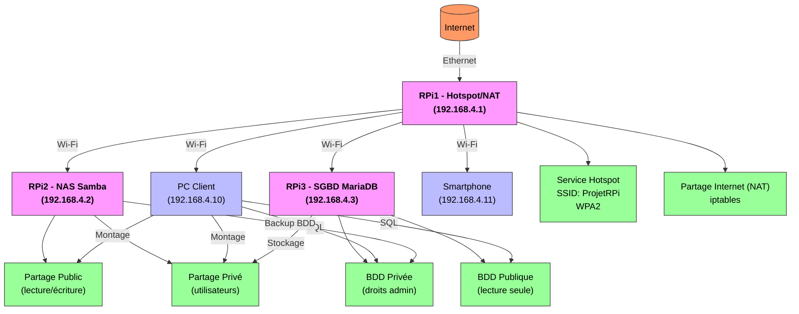

# Systeme-Alerte-Connecte-avec-Raspberry-Pi

## Mini-projet : Architecture réseau locale et services associés avec Raspberry Pi

## Présentation

Ce mini-projet vise à concevoir et déployer une infrastructure réseau locale autonome basée sur plusieurs Raspberry Pi, avec les services suivants :

- Point d’accès Wi-Fi sécurisé (hotspot) avec partage de connexion Internet
- Serveur NAS pour partage de fichiers (public et privé)
- Serveur de base de données (MariaDB) avec gestion des droits utilisateurs

Le réseau doit fonctionner de manière isolée tout en pouvant partager une connexion Internet.

---

### Exécution des scripts

Si chaque groupe à créer des scripts correspondant à son service sur son Raspberry Pi.

Exemple : pour lancer un script pour le serveur NAS (RPi2)

```bash
cd scripts (dossier du script)
sudo bash install_samba.sh
```

---

### Fiches de recette

Pour chaque service, complétez une fiche de recette en listant les tests réalisés et leur résultat.

---

### Bonnes pratiques

- Respectez les conventions de nommage et les droits d’accès.
- Testez vos services depuis différents clients (RPi, PC).
- Documentez toute modification dans vos fiches de recette.

---

### Ressources utiles

- [Documentation Raspberry Pi OS](https://www.raspberrypi.org/documentation/)
- [Samba](https://www.samba.org/samba/docs/current/man-html/smb.conf.5.html)
- [MariaDB](https://mariadb.com/kb/en/)

---

## Annexes

### **Planning**

**Calendrier indicatif** :

| Séance  | Groupe 1 (Hotspot)       | Groupe 2 (NAS)          | Groupe 3 (SGBD)        | Tous               |
|-------|--------------------------|-------------------------|------------------------|--------------------|
| 1     | Préparation + mise à jour | Idem                   | Idem                  | Réunion de lancement |
| 2     | Configuration hotspot    | Installation Samba      | Installation MariaDB   | Point d’avancement  |
| 3     | NAT + tests              | Partages + utilisateurs | BDD + droits           | Tests croisés      |
| 4     | Documentation            | Montage automatique     | Sauvegardes            | Finalisation       |

### **Évaluation**

**Grille d’évaluation** :

| Critère                | Poids | Notes |
|------------------------|-------|-------|
| Fonctionnalité         | 40%   | Services opérationnels et interopérables |
| Documentation          | 25%   | Clarté, exhaustivité, schémas |
| Scripts                | 20%   | Automatisation, gestion d’erreurs |
| Présentation           | 15%   | Démonstration fluide, réponses aux questions |

### **Exemples de commandes utiles** :

```bash
# Tester la connectivité réseau
iperf3 -s  # Sur le serveur
iperf3 -c 192.168.4.1  # Sur le client

# Vérifier les règles NAT
sudo iptables -t nat -L -n -v

# Tester les droits Samba
smbclient //192.168.4.2/prive -U etudiant1%motdepasse -c "ls"
```

- **Modèles de fichiers de configuration** :
  - Fournir des templates commentés pour `hostapd.conf`, `smb.conf`, et `my.cnf`.
- **FAQ** :
  - Que faire si le hotspot n’apparaît pas ? → Vérifier `sudo systemctl status hostapd`, `rfkill list`, etc.

---

### **Schéma réseau global (Mermaid)**



---

#### **Notes :**

1. **Topologie** :
   - **RPi1** (Hotspot/NAT) est le point central : il fournit le réseau Wi-Fi et partage la connexion Internet.
   - **RPi2** (NAS) et **RPi3** (SGBD) se connectent au hotspot de RPi1.
   - Les **clients** (PC, smartphone) se connectent aussi au hotspot.

2. **Services** :
   - **Hotspot/NAT** : Géré par RPi1 (SSID, DHCP, partage Internet).
   - **Samba** : Partages public/privé sur RPi2.
   - **MariaDB** : BDD publique/privée sur RPi3.

3. **Flux** :
   - Les clients montent les partages Samba et accèdent aux BDD.
   - RPi2 peut sauvegarder les BDD de RPi3 sur son stockage privé.
   - RPi3 peut stocker des données sur le NAS privé de RPi2.

---

#### **Légendes**

- **RPi1** est en rose/violet (point d’accès).
- **RPi2/RPi3** en rose/violet (services).
- **Clients** en bleu.
- **Services** en vert (Hotspot, NAT, Samba, BDD).

---

- **Détail des ports (exemple)** :
  ```mermaid
  graph TD
      RPi1 -->|Port 445| SambaPublic
      RPi3 -->|Port 3306| DBPublic
  ```

---

### **Suivi d’avancement des binômes (RPi) – Version 1.0 (exemple)**

| **Binôme** | **RPi** | **Avancement** | **Notes** |
| ---------- | ------- | -------------- | ---------- |
| **..... / .....** | **RPi1 – Hotspot Wi-Fi** |  | Hotspot visible, NAT fonctionnel, mais certains clients seulement peuvent se connecter |
| **..... / .....** | **RPi2 – Serveur NAS** |  | Préparation des dossiers (public/privé) et quelques configurations de base |
| **..... / .....** | **RPi3 – SGBD (MariaDB)** |  | Base de données publique/privée, sauvegardes, et quelques tests croisés |

---

#### **Notes pour chaque binôme* (exemple)*

##### **RPi1 – Hotspot Wi-Fi (..... / .....)**

| **Étape** | **Description** | **Statut** |
| ---------- | --------------- | ---------- |
| **Hotspot** | SSID "ProjetRPi" avec WPA2 | 🟢 |
| **NAT** | Accès Internet via le hotspot | 🟢 |
| **DHCP** | Plage 192.168.4.2-20 | 🟢 |
| **Clients** | Connexion des clients | 🟡 (certains) |

**Hotspot Wi-Fi (RPi1)**

- **Hotspot** : SSID "ProjetRPi" avec WPA2  
- **NAT** : Accès Internet via le hotspot  
- **DHCP** : Plage 192.168.4.2-20  
- **Clients** : Connexion des clients (certains seulement) 


##### **RPi2 – Serveur NAS (..... / .....)**

| **Étape** | **Description** | **Statut** |
| ---------- | --------------- | ---------- |
| **Dossiers** | Public/privé | 🟢 |
| **Samba** | Configuration | 🟡 (basique) |
| **Clients** | Montage des partages | 🟡 (certains) |

**Serveur NAS (RPi2)**

- **Dossiers** : Public/privé  
- **Samba** : Configuration (basique)  
- **Clients** : Montage des partages (certains) 

##### **RPi3 – SGBD (..... / .....)**

| **Étape** | **Description** | **Statut** |
| ---------- | --------------- | ---------- |
| **Base de données** | Publique/privée | 🟢 |
| **Sauvegardes** | Scripts | 🟢 |
| **Clients** | Accès depuis RPi2 | 🟢 |

**SGBD (RPi3)**

- **Base de données** : Publique/privée  
- **Sauvegardes** : Scripts  
- **Clients** : Accès depuis RPi2 

#### Légendes

- 🟢 = Terminé / Fonctionnel  
- 🟡 = Partiellement fonctionnel ou en cours  
- ⚪ = Non commencé 

---

### **Frise chronologique du projet RPi (exemple)**

```
RPi1 – Hotspot Wi-Fi (..... / .....)
[🟢 Hotspot] ---> [🟢 NAT] ---> [🟢 DHCP] ---> [🟡 Clients]

RPi2 – Serveur NAS (..... / .....)
[🟢 Dossiers] ---> [🟡 Samba (basique)] ---> [🟡 Clients]

RPi3 – SGBD (..... / .....)
[🟢 BDD Publique/Privée] ---> [🟢 Sauvegardes (scripts)] ---> [🟢 Clients]
```

#### **Détails**

##### RPi1 – Hotspot Wi-Fi

- Mise en place du hotspot et sécurisation **terminées**  
- NAT et DHCP **opérationnels**  
- Connexion de tous les clients encore **partielle (en cours)**  

##### RPi2 – Serveur NAS

- Création des dossiers (public/privé) **terminée**  
- Configuration Samba restreinte (**basique**)  
- Montage des partages par certains clients seulement (**en cours**)  

##### RPi3 – SGBD

- Mise en place de la base publique/privée **terminée**  
- Sauvegardes automatisées (scripts) **fonctionnelles**  
- Connexion client (depuis RPi2) **validée**  

#### **Lecture de la frise**

- Chaque **flèche** (—>) indique l’avancement logique des étapes.  
- Les **pastilles de couleur** (🟢, 🟡) permettent de voir rapidement où en est chaque binôme.  
- L’ensemble montre que **le binôme RPi3 est déjà finalisé**, tandis que **RPi1 et RPi2 doivent encore finaliser la partie clients** pour atteindre un état complet.  

---
